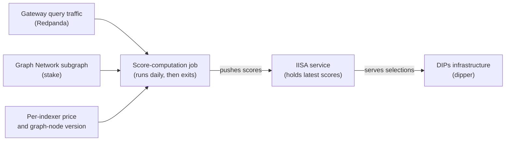

# Subgraph DIPs Indexer Selection

The Indexing Indexer Selection Algorithm (IISA) for The Graph's Direct Indexer Payments service. It decides which indexers should be selected to index and serve a given subgraph deployment, ranking every candidate by a weighted blend of quality and economic signals drawn from real query traffic and on-chain stake.

## Background

The Graph is a decentralised network where independent operators, called *indexers*, organise blockchain data into *subgraphs* and answer queries against them. Most of an indexer's income comes from protocol indexing rewards, which are spread across the whole network. Direct Indexer Payments (DIPs) sit alongside that: a consumer pays a chosen indexer directly — a recurring fee, quoted in GRT per 30 days — to commit to indexing and serving one specific subgraph deployment.

That arrangement only works if someone decides which indexers should receive those paid agreements, keeps the best-performing ones in place, and replaces the ones that fall behind. Making that decision well is the job of this project.

## What it produces

Given a subgraph deployment and the number of indexers it needs, the service returns the set of indexers that should serve it, each with its price for the requested chain. The answer is a recommendation. The DIPs infrastructure that calls it — a service known as *dipper* — compares the recommendation against the agreements that already exist and works out which to add and which to cancel. This project never signs or cancels an agreement itself; it only advises, so the answer can also shift between calls as fresh scores arrive.

## How it works

The system has two cooperating parts that share nothing on disk. A daily score-computation job measures how every indexer has actually been performing and pushes the results to the service. A long-running HTTP service keeps the latest scores in memory and answers selection requests. The job sends its results to the service over the network, and the service is the single owner of the data it serves. Both run on Kubernetes — the service as a long-lived deployment, the measurement work as a scheduled job that runs once a day and then exits.

### Measuring indexers

Once a day the job replays roughly the last few weeks of real gateway query traffic from a Redpanda (Kafka) topic — a window the operator can widen or narrow — and combines it with live stake data from the Graph Network subgraph and a fresh price quote fetched from each indexer. From that it derives, for every indexer:

- **Economic security** — slashable stake measured against the query fees the indexer has earned. More stake standing behind fewer fees means more to lose by misbehaving.
- **Price** — what the indexer charges to serve the deployment, quoted both per 30 days and per billion entities served.
- **Latency** — how quickly it answers, estimated with a regression that accounts for the geographic distance between the indexer and where queries originate.
- **Uptime** — how much of the observed window the indexer was available.
- **Success rate** — the share of its queries that returned a usable result.

Because the traffic is enormous, the job samples it instead of reading every record, and balances the sample so each indexer is represented fairly rather than being drowned out by the busiest ones. The sampling is seeded, so a given seed and the same input reproduce the same scores.

The measurement is built to degrade rather than disappear. If geographic lookups are unavailable it falls back to neutral latency scores; if the wider pipeline fails it still publishes real prices with equal quality scores rather than going dark. It can also be told to exclude any indexer running below a minimum `graph-node` version, so stale software does not win paid work.

### Choosing indexers

When asked to fill a deployment, the service blends each indexer's measurements into a single weighted score:

| Signal | Better | Weight |
| --- | --- | --- |
| Economic security (stake-to-fees) | higher | 0.30 |
| Price (per 30 days) | lower | 0.25 |
| Latency | lower | 0.20 |
| Uptime | higher | 0.15 |
| Success rate | higher | 0.05 |
| Price (per billion entities) | lower | 0.05 |

*Better* is the direction that earns a higher score: latency and price are inverted during scoring, so a lower raw value scores higher. These are the current default weights — the source of truth is `DEFAULT_WEIGHTS` in `src/iisa/indexer_selection.py`, and a caller can override them per request.

From those scores it selects the number of indexers the caller asks for, shaped by a handful of constraints. It stays within the price ceiling the caller specifies and skips indexers that do not serve the requested chain. When more than one indexer is needed it tries to spread them across distinct operators and locations, falling back to the best available when no combination satisfies that. When it knows which indexers are already synced to the deployment, it favours them, so queries can be served the moment an agreement is accepted. It leaves a working incumbent in place, stepping in only once the group is already at its target size and an incumbent has dropped well below an acceptable score while a challenger beats it by a clear margin — so the set does not churn on small fluctuations. And it never picks an indexer the caller has blocked. The exact thresholds behind these rules live alongside the weights in `src/iisa/indexer_selection.py`.

## Repository layout

| Path | What lives there |
| --- | --- |
| `src/iisa/` | The HTTP service: the score cache, the weighting, and the selection logic. |
| `cronjobs/compute_scores/` | The daily measurement job: gateway-traffic replay, metric computation, and the client that pushes scores. |
| `k8s/` | The Kubernetes manifests for the service and the daily job. |
| `tests/` | The test suite. |
